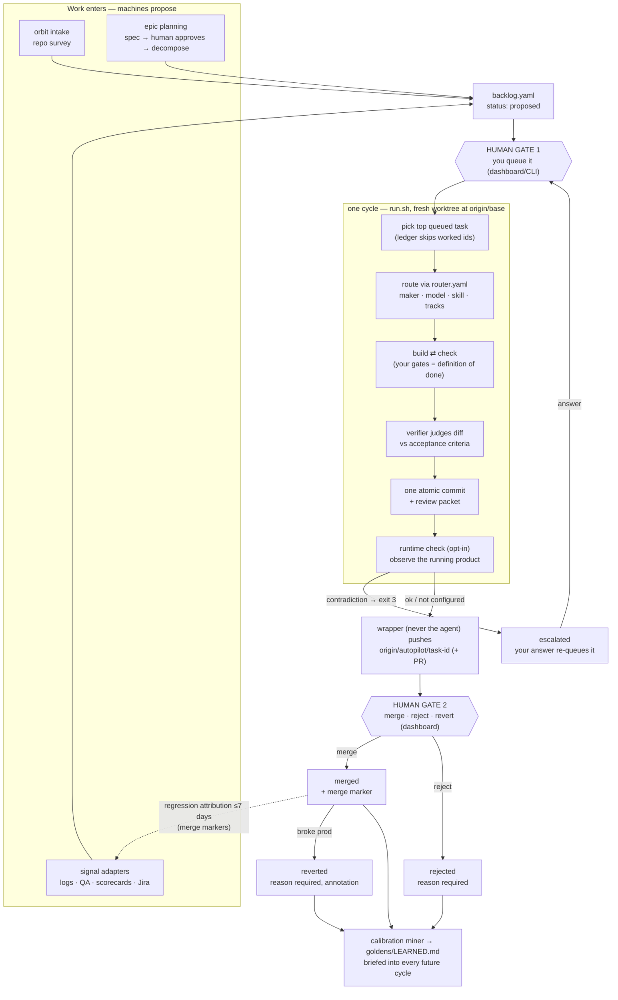
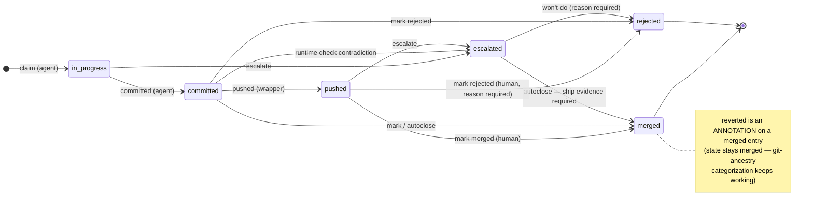

# Orbit

**An autonomous software-lifecycle loop for Claude Code that works on any git repo.**

Point Orbit at a repository and it covers the lifecycle around the code: **intake**
surveys the repo into an evidence-backed backlog, **epics** plan big work into
human-approved specs and loop-sized slices, the **build loop** works one task at a
time around the clock, each ship lands as **one atomic commit on its own review
branch** (optionally as a ready-made PR), and **signal adapters** feed production
evidence back into the backlog. Two things never happen without a human click:
work entering the queue, and work merging.

```
intake ─▶ backlog ─▶ (epic? plan ─▶ you approve ─▶ decompose) ─▶ you queue
one cycle:  pick task ─▶ route (maker · model · skill · tracks) ─▶ build ⇄ check ─▶ verify-spec ─▶ commit ─▶ push review branch (+PR) ─▶ you merge
signals (logs · QA · scorecards) ─▶ proposed tasks ─▶ back to triage
```

One notch forward per cycle, never backward, every change independently reviewable.

## Why this exists

Running a coding agent unattended fails in predictable ways: it invents work, ships
half-verified changes, piles unrelated edits into one diff, or quietly pushes to main.
Orbit is the harness that removes those failure modes:

- **Machines propose, humans dispose.** Intake, epic decomposition, and signal adapters
  can only create `proposed` tasks; a human queues every piece of work, and no task in
  the queue means the loop exits cleanly. It never invents work.
- **Your own test/lint commands (the "gates") are the definition of done.** A checker
  agent must show real passing output — assertions of "all green" are rejected.
- **A separate verifier agent judges the diff against the task's acceptance criteria**
  before anything is committed. Tasks without acceptance criteria are hard-gated out.
- **The agent cannot push.** Only the wrapper script pushes, always to a per-task
  branch, never `--force`, never the base branch. With `pull_requests: "github"` the
  wrapper also opens the PR (via your `gh` login — the agent never holds credentials);
  merging stays yours.
- **Big work is designed before it's built.** An `epic` task can never reach the loop —
  a planner writes a spec, a human approves it, and only then is it decomposed into
  one-commit slices.
- **Anything requiring judgment escalates to you** — auth, payments, migrations,
  secrets, CI config, and architecture decisions are refused, not attempted.

## How it stays repo-agnostic

One boundary splits everything: the **engine** (this repo, generic, never names a
project) vs. the **profile** (everything project-specific, living in the target
repo's `.autopilot/` directory).

```
orbit/  (engine — install once)        <your-repo>/.autopilot/  (profile — per repo)
├── engine/    loop + helpers            ├── config.yaml   repo, base branch, GATES, model
├── agents/    builder/checker/verifier  ├── router.yaml   optional routing override
├── skills/    the /orbit-cycle command  ├── tracks/       your repo's playbooks
├── router/    default routing           ├── backlog.yaml  the task queue
├── tracks/    generic templates         └── state/        ledger, queue, reviews (gitignored)
├── goldens/   graded output exemplars
├── adapters/  opt-in task sources
└── install/   launchd + systemd service
```

The one block that makes Orbit work on *your* repo is **`gates:`** in
`.autopilot/config.yaml` — the commands that prove your repo is healthy (tests,
lint, typecheck). `install.sh` auto-detects a starter set from your stack; you
confirm it. Everything else has sensible defaults.

## Architecture

Orbit is a **deterministic pipeline wrapped around one autonomous step**. The
engine (bash + stdlib Python) encodes every stage, branch, and human gate in
plain code; the single place where the path can't be known in advance —
"implement this task in this codebase" — runs as a full agentic loop inside an
isolated git worktree. Everything before and after that node is explicit,
auditable, and testable.

### The flow



Two human gates bound the loop: **nothing enters the queue and nothing merges
without a click**. Every other arrow is machine-driven and leaves evidence
(review packet, backup patch, ledger entry, log line).

### The task lifecycle (the ledger state machine)

Every task Orbit works has one entry in `state/ledger.json`; its `state` field
moves through an explicit machine (`engine/lifecycle.py`) that every writer —
the cycle agent, the wrapper, the dashboard, autoclose — is validated against.



The machine distinguishes two kinds of event:

- **Loop events** (`claim`, `committed`, `pushed`, `escalate`) record facts
  that already happened in git — they are permissive, including late-recorded
  facts (an agent that skipped `claim` still gets its `committed` recorded).
- **Review events** (`merged`, `rejected`, `reverted`) record human judgments —
  they are strict: only reachable from a reviewable state, and `merged` /
  `reverted` additionally require ship evidence (a `sha`, `remote_ref`, or
  `branch`). You cannot merge, reject, or revert work that never shipped, and
  terminal states accept nothing further (a double-mark would write a duplicate
  merge marker and poison regression attribution).

An illegal transition prints why and **exits 3, writing nothing** — the
dashboard surfaces the explanation, the wrapper logs a loud `WARN`. Operators
can override any refusal with `ledger.py <verb> --force`, which stamps
`forced: true` on the entry so overrides stay auditable. `ledger.py can <id>
<event>` answers "would this be legal?" without side effects (the dashboard's
rollback checks it *before* running `git revert`).

Mid-cycle states can't rot: each iteration the wrapper **reaps** entries stuck
at `in_progress` (claim-then-crash) or `committed` (died between commit and
push) for longer than the cycle timeout, escalating them onto the operator
gates — and a push that fails twice escalates immediately. Nothing sits in
silent limbo.

Two subtleties the machine encodes deliberately:

- **Git ancestry is the authority for "merged."** A branch merged in the GitHub
  UI never calls `mark`, so the ledger may lag at `pushed` — which is why
  `reverted` is legal from `committed`/`pushed`/`merged`, and why the dashboard
  categorizes by ancestry first.
- **`escalated → merged` is legal only with ship evidence** — the autoclose
  reconciler flips a task that committed, escalated at the runtime check, and
  whose branch you merged anyway.

The backlog layer has its own, simpler ladder in the task's `status` field —
`proposed → queued → done` (plus the epic stages `planning → spec_ready →
approved → decomposed`, guarded by `epic_plan.py`'s own transition table).
The ledger machine picks up where the backlog hands a queued task to the loop.

### Who writes what

| actor | may write | may never |
|-------|-----------|-----------|
| intake / adapters / epic decompose | backlog `status: proposed` | queue work |
| **you** (dashboard / CLI) | promote to `queued`; `merged` / `rejected` / `reverted` (with reasons) | — |
| cycle agent (worktree) | `claim`, `committed`, `escalate` | push, merge, touch your checkout |
| wrapper (`run.sh`) | `pushed`, `escalate`, PR metadata | push to base, `--force` push |
| autoclose | `merged` (only with ancestry proof, via the same machine) | close rejected ships |

## Quickstart

```bash
# 1. install the engine (once per machine)
git clone https://github.com/<you>/orbit ~/orbit

# 2. onboard a repo
cd ~/code/my-project
~/orbit/install.sh .        # scaffolds .autopilot/, auto-detects gates, installs /orbit-cycle, links `orbit`

# 3. review the two things auto-detection can't nail
$EDITOR .autopilot/config.yaml    # confirm gates: commands actually pass locally
$EDITOR .autopilot/backlog.yaml   # add tasks (with acceptance criteria — required)
orbit intake .              # …or let intake propose a starter backlog + fill the tracks

# 4. validate, try one cycle in the foreground, then go unattended
orbit doctor .              # read-only wiring check + routing dry-run
orbit run .                 # watch it work one task
orbit install .             # background service (launchd on macOS, systemd on Linux)
```

Full walkthrough with prerequisites, first-cycle verification, and troubleshooting:
**[docs/RUNBOOK.md](docs/RUNBOOK.md)**.

## Commands

`orbit <verb> <target-repo>` — a thin dispatcher (`bin/orbit`):

| verb | does |
|------|------|
| `init` | scaffold `.autopilot/` (same as `install.sh`) |
| `intake` | survey the repo: verify gates, fill tracks, propose an evidence-backed backlog |
| `epic` | planning tier: `plan\|approve\|decompose\|status <id>` — spec first, humans approve |
| `doctor` | validate config + router + tracks + skills; dry-run routing (read-only) |
| `run` | run the loop in the foreground |
| `install` | install the background service |
| `sync` | re-copy the engine's command + agents into the target (after an engine `git pull`) |
| `pause` / `resume` | kill switch (touch / remove the STOP file) |
| `status` | queue + ledger + today's spend |
| `digest` | every stalled human gate in one read (`--send` → Slack/macOS with a dashboard link) |
| `learn` | mine the ledger into calibration candidates — approve on the dashboard, briefed from the next cycle |
| `report` | per-category outcome rates: do the learned lessons actually bend the curves? |

## The dashboard

`engine/command_center.py` serves a live control panel (stdlib-only, default
`http://127.0.0.1:8787`): watch the in-flight task, reorder or promote backlog
items, answer escalations, review finished branches, merge/reject/revert ships,
and manage `autopilot/*` branches — all without disturbing the running loop.
What each section means and how to operate it: **[docs/OPERATOR-GUIDE.md](docs/OPERATOR-GUIDE.md)**.

## Requirements

- **[Claude Code](https://claude.com/claude-code)** (`claude`) on PATH — Orbit drives
  it headless (`claude -p /orbit-cycle`).
- Python 3 with `pyyaml`. Git.
- A test/lint command for your repo (the gates).
- For the background service: launchd (macOS) or systemd-user (Linux). On Windows,
  run `orbit run` under your own supervisor.

## Safety posture

- The agent runs **push-denied and destructive-git-denied**
  (`config/orbit.settings.json`); only the wrapper pushes, and unattended deletes
  escalate instead of executing.
- Auth / payments / migrations / secrets / CI edits are refused unless a task is
  explicitly `forced: true` **and** code-fixable.
- Every cycle leaves a backup patch (`state/diffs/`) and a review packet
  (`state/reviews/`), so every ship is auditable and every merge revertible.

## Documentation

| doc | read it for |
|-----|-------------|
| [docs/RUNBOOK.md](docs/RUNBOOK.md) | step-by-step setup with Claude Code, first cycle, going unattended, troubleshooting |
| [docs/SETUP.md](docs/SETUP.md) | the full `.autopilot/` profile reference (config, tracks, backlog, adapters) |
| [docs/ARCHITECTURE.md](docs/ARCHITECTURE.md) | how the pieces fit: the cycle, routing, skills vs tracks, state |
| [docs/OPERATOR-GUIDE.md](docs/OPERATOR-GUIDE.md) | the dashboard, plain-words — what each section is and what you do there |
| [config/schema.yaml](config/schema.yaml) | every config field, documented at the source of truth |

## License

See [LICENSE](LICENSE).
